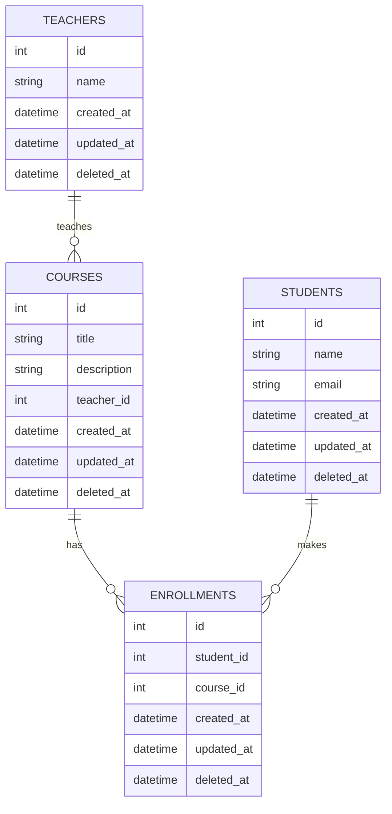
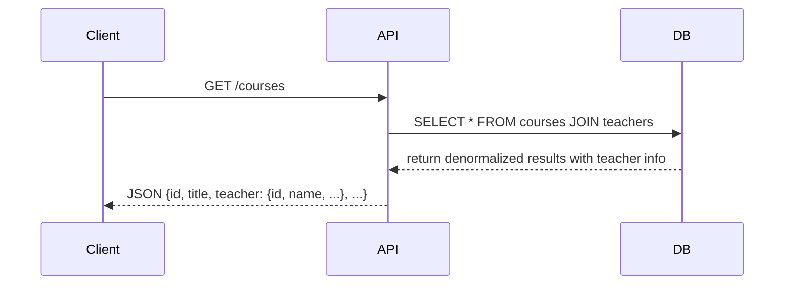

```mermaid
erDiagram
    TEACHERS ||--o{ COURSES : teaches
    COURSES ||--o{ ENROLLMENTS : has
    STUDENTS ||--o{ ENROLLMENTS : makes

    TEACHERS {
        int id
        string name
        datetime created_at
        datetime updated_at
        datetime deleted_at
    }
    COURSES {
        int id
        string title
        string description
        int teacher_id
        datetime created_at
        datetime updated_at
        datetime deleted_at
    }
    STUDENTS {
        int id
        string name
        string email
        datetime created_at
        datetime updated_at
        datetime deleted_at
    }
    ENROLLMENTS {
        int id
        int student_id
        int course_id
        datetime created_at
        datetime updated_at
        datetime deleted_at
    }
```

```mermaid
sequenceDiagram
    participant Client
    participant API
    participant DB

    Client->>API: GET /courses
    API->>DB: SELECT * FROM courses JOIN teachers
    DB-->>API: return denormalized results with teacher info
    API-->>Client: JSON {id, title, teacher: {id, name, ...}, ...}
```
